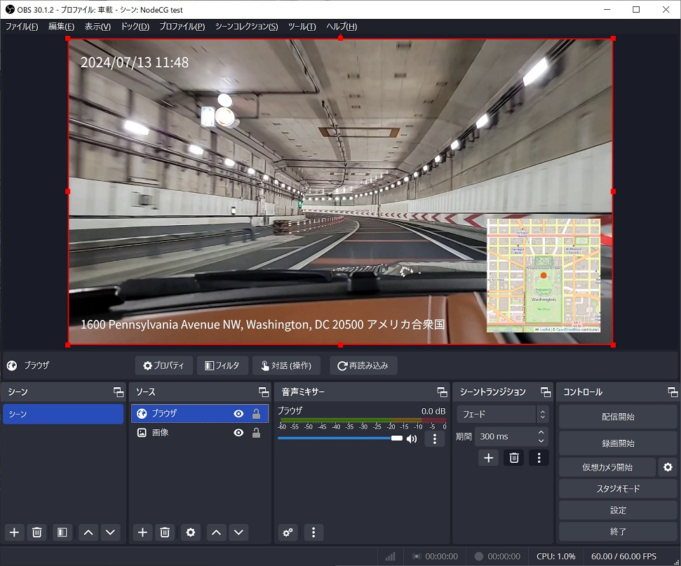
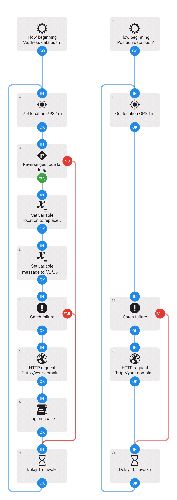

# Geolocation bundle for drive livestreaming

## 概要



位置情報をモバイル端末から受け取って、配信画面に地図として表示するための [NodeCG](http://github.com/nodecg/nodecg) バンドルです。
ドライブ配信、街歩き配信等で使用することを想定しています。

NodeCG `^2.0.0` に対応しています。

詳細は [ブログ記事](https://blog.opensphere.co.jp/posts/nodecg001) を参照してください。

## REST API

本バンドルでは、外部からアクセス可能な REST API が提供されます。
モバイル端末からのアクセスを想定しています。

POST のみ受け付けます。
NodeCG のセキュリティが有効な場合はエンドポイント URI に `?key=NodeCG Key` を付加してください。

> `NodeCG Key` は NodeCG ダッシュボードの SETTINGS から取得できます。

### 地図の座標設定

#### エンドポイント

> POST `/geolocation-bundle/position`

#### リクエスト

```json
{
  "position": [ 35.686152, 139.752842 ]
}
```

- `position` - latitude (緯度), longitude (経度) の順で `number` の配列

###  住所表示更新

#### エンドポイント

> POST `/geolocation-bundle/address`

#### リクエスト

```json
{
  "address": "東京都千代田区丸の内1-1-1"
}
```

- `address` - `string`

## アセット

### marker

地図上に現在値を示すマーカーを表示可能です。
透過ありの png, gif, svg を使用可能です。 
アニメーションも使用可です。

NodeCG ダッシュボードからアップロードしてください。

## Android 端末向け REST API クライアント

Android 向けの REST API クライアントが[こちら](./for-mobile/automate/NodeCG_Geolocation_Push.flo)からダウンロードできます。

クライアントと言っても Automate のフロー（スクリプト）です。

Automate をインストールしてから、フローをインポートしてください。



## 開発

以下のコマンドが使用可能です。

-   `npm run build`: バンドルをビルド
-   `npm run watch`: ファイルの変更を監視して自動的にビルドします
-   `npm run dev`: ファイルの変更を監視して自動的にビルドし、動作環境に反映します。必要に応じて NodeCG の開発サーバーを再起動します

